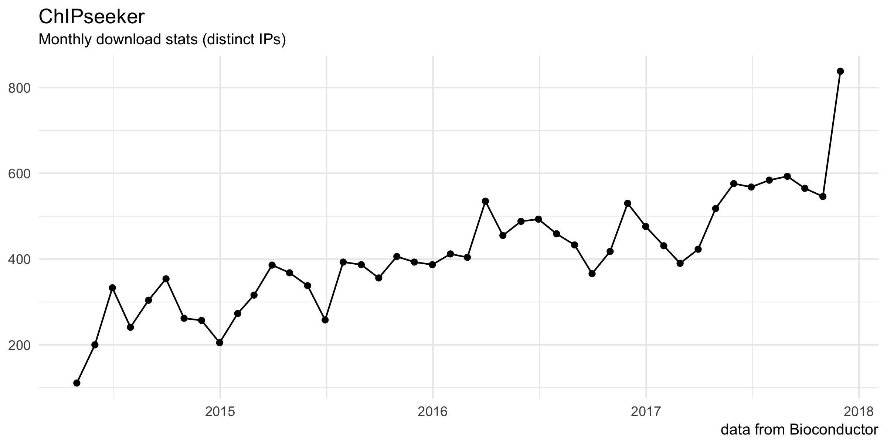

ChIPseeker: ChIP peak Annotation, Comparison, and Visualization
===============================================================

    

     

   

This package implements functions to retrieve the nearest genes around the peak, annotate genomic region of the peak, statstical methods for estimate the significance of overlap among ChIP peak data sets, and incorporate GEO database for user to compare their own dataset with those deposited in database. The comparison can be used to infer cooperative regulation and thus can be used to generate hypotheses. Several visualization functions are implemented to summarize the coverage of the peak experiment, average profile and heatmap of peaks binding to TSS regions, genomic annotation, distance to TSS, and overlap of peaks or genes.

For details, please visit our project website, <https://guangchuangyu.github.io/ChIPseeker>.

-   [Documentation](https://guangchuangyu.github.io/ChIPseeker/documentation/)
-   [Featured Articles](https://guangchuangyu.github.io/ChIPseeker/featuredArticles/)
-   [Feedback](https://guangchuangyu.github.io/ChIPseeker/#feedback)

------------------------------------------------------------------------

Please cite the following article when using `ChIPseeker`:

***Yu G***, Wang LG and He QY\*. ChIPseeker: an R/Bioconductor package for ChIP peak annotation, comparison and visualization. ***Bioinformatics*** 2015, 31(14):2382-2383.

 

------------------------------------------------------------------------

### Citation

### Download stats

  

