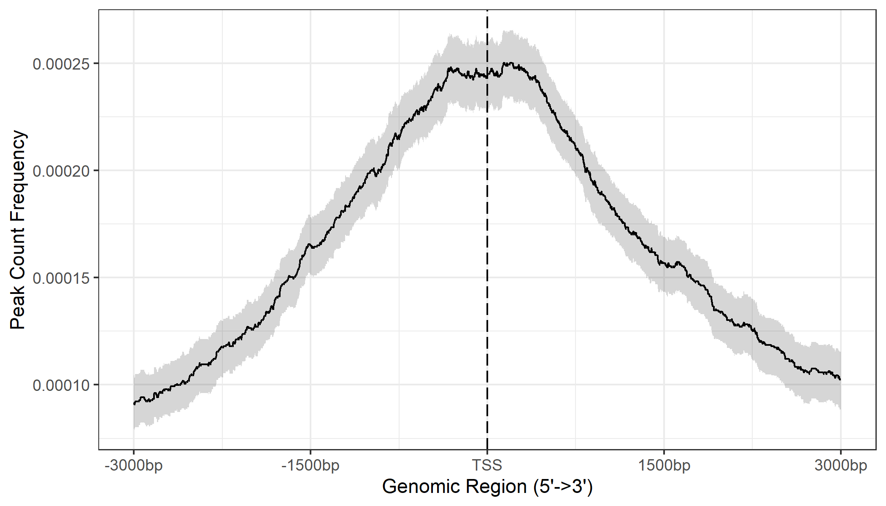
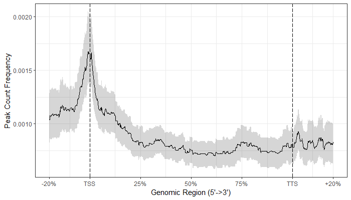
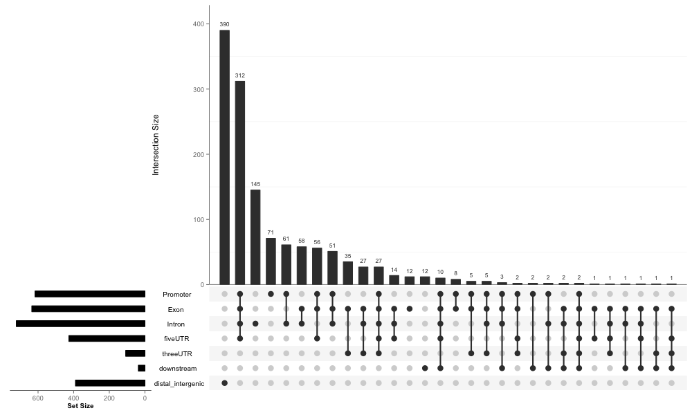
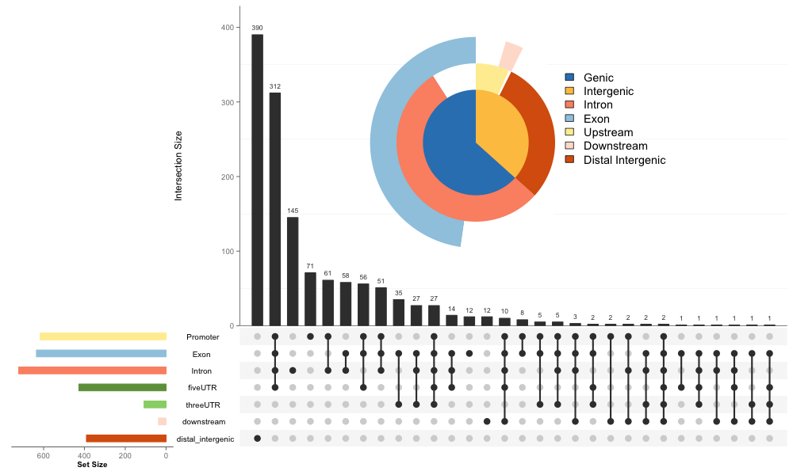
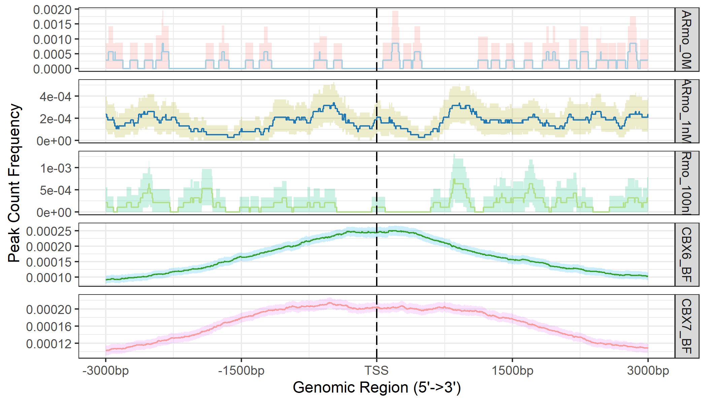
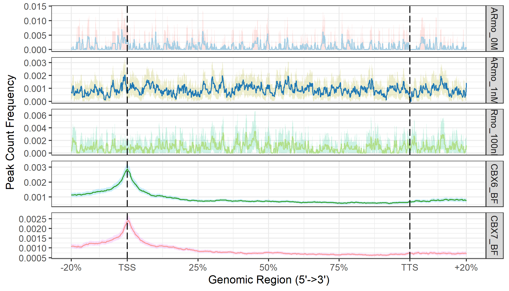

```{r style, echo=FALSE, results='asis', message=FALSE}
knitr::opts_chunk$set(tidy         = FALSE,
                      warning      = FALSE,
                      message      = FALSE)

library(yulab.utils)
Biocannopkg <- yulab.utils::Biocpkg
```

```{r echo=FALSE, results='hide', message=FALSE}
library(GenomicFeatures)
library(GenomicRanges)
library(TxDb.Hsapiens.UCSC.hg19.knownGene)
library(org.Hs.eg.db)
library(ggplot2)
library(clusterProfiler)
library(ReactomePA)
library(ChIPseeker)
```

# Abstract

ChIPseeker is an R package for annotating ChIP-seq data analysis. It supports annotating ChIP peaks and provides functions to visualize ChIP peaks coverage over chromosomes and profiles of peaks binding to TSS regions. Comparison of ChIP peak profiles and annotation are also supported. Moreover, it supports evaluating significant overlap among ChIP-seq datasets. Currently, ChIPseeker contains 17,000 bed file information from GEO database. These datasets can be downloaded and compare with user's own data to explore significant overlap datasets for inferring co-regulation or transcription factor complex for further investigation.


# Citation

If you use `r Biocpkg("ChIPseeker")`[@yu_chipseeker_2015] in published research, please cite:

+ Q Wang<sup>#</sup>, M Li<sup>#</sup>, T Wu, L Zhan, L Li, M Chen, W Xie, Z Xie, E Hu, S Xu, __G Yu__<sup>\*</sup>. [Exploring epigenomic datasets by ChIPseeker](https://onlinelibrary.wiley.com/share/author/GYJGUBYCTRMYJFN2JFZZ?target=10.1002/cpz1.585). __*Current Protocols*__, 2022, 2(10): e585. 
+ __G Yu__<sup>\*</sup>, LG Wang, QY He<sup>\*</sup>. [ChIPseeker: an R/Bioconductor package for ChIP peak annotation, comparision and visualization](http://bioinformatics.oxfordjournals.org/cgi/content/abstract/btv145). __*Bioinformatics*__. 2015, 31(14):2382-2383. 


# Introduction

Chromatin immunoprecipitation followed by high-throughput sequencing (ChIP-seq) has become standard technologies for genome wide identification of DNA-binding protein target sites. After read mappings and peak callings, the peak should be annotated to answer the biological questions. Annotation also create the possibility of integrating expression profile data to predict gene expression regulation. `r Biocpkg("ChIPseeker")`[@yu_chipseeker_2015] was developed for annotating nearest genes and genomic features to peaks.

ChIP peak data set comparison is also very important. We can use it as an index to estimate how well biological replications are. Even more important is applying to infer cooperative regulation. If two ChIP seq data, obtained by two different binding proteins, overlap significantly, these two proteins may form a complex or have interaction in regulation chromosome remodelling or gene expression. `r Biocpkg("ChIPseeker")`[@yu_chipseeker_2015] support statistical testing of significant overlap among ChIP seq data sets, and incorporate open access database GEO for users to compare their own dataset to those deposited in database. Protein interaction hypothesis can be generated by mining data deposited in database. Converting genome coordinations from one genome version to another is also supported, making this comparison available for different genome version and different species.

Several visualization functions are implemented to visualize the coverage of the ChIP seq data, peak annotation, average profile and heatmap of peaks binding to TSS region.

Functional enrichment analysis of the peaks can be performed by my Bioconductor packages `r Biocpkg("DOSE")`[@yu_dose_2015], `r Biocpkg("ReactomePA")`[@yu_reactomepa_2016], `r Biocpkg("clusterProfiler")`[@yu_clusterprofiler_2012].

```{r}
## loading packages
library(ChIPseeker)
library(TxDb.Hsapiens.UCSC.hg19.knownGene)
txdb <- TxDb.Hsapiens.UCSC.hg19.knownGene
library(clusterProfiler)
```

# ChIP profiling
The datasets _CBX6_ and _CBX7_ in this vignettes were downloaded from _GEO (GSE40740)_[@pemberton_genome-wide_2014] while _ARmo\_0M_, _ARmo\_1nM_ and _ARmo\_100nM_ were downloaded from _GEO (GSE48308)_[@urbanucci_overexpression_2012] . `r Biocpkg("ChIPseeker")` provides `readPeakFile` to load the peak and store in `GRanges` object.

```{r}
files <- getSampleFiles()
print(files)
peak <- readPeakFile(files[[4]])
peak
```

## ChIP peaks coverage plot

After peak calling, we would like to know the peak locations over the whole genome, `covplot` function calculates the coverage of peak regions over chromosomes and generate a figure to visualize. [GRangesList](https://guangchuangyu.github.io/2016/02/covplot-supports-grangeslist) is also supported and can be used to compare coverage of multiple bed files.


```{r fig.height=8, fig.width=10}
covplot(peak, weightCol="V5")
```

```{r eval=FALSE, fig.height=4, fig.width=10}
covplot(peak, weightCol="V5", chrs=c("chr17", "chr18"), xlim=c(4.5e7, 5e7))
```


## Profile of ChIP peaks binding to TSS regions

First of all, for calculating the profile of ChIP peaks binding to TSS regions, we should prepare the TSS regions, which are defined as the flanking sequence of the TSS sites. Then align the peaks that are mapping to these regions, and generate the tagMatrix.


```{r}
## promoter <- getPromoters(TxDb=txdb, upstream=3000, downstream=3000)
## tagMatrix <- getTagMatrix(peak, windows=promoter)
##
## to speed up the compilation of this vignettes, we use a precalculated tagMatrix
data("tagMatrixList")
tagMatrix <- tagMatrixList[[4]]
```

In the above code, you should notice that tagMatrix is not restricted to TSS regions. The regions can be other types that defined by the user. `r Biocpkg("ChIPseeker")` expanded the scope of region. Users can input the `type` and `by` parameters to get the regions they want.

### Heatmap of ChIP binding to TSS regions

```{r fig.cap="Heatmap of ChIP peaks binding to TSS regions", fig.align="center", fig.height=9, fig.width=6}
tagHeatmap(tagMatrix)
```

`r Biocpkg("ChIPseeker")` provide a one step function to generate this figure from bed file. The following function will generate the same figure as above.

```{r eval=FALSE}
peakHeatmap(files[[4]], TxDb=txdb, upstream=3000, downstream=3000)
```

Users can use `nbin` parameter to speed up.
```{r eval=FALSE}
peakHeatmap(files[[4]],TxDb = txdb,nbin = 800,upstream=3000, downstream=3000)

```

Users can also use ggplot method to change the details of the figures.
```{r eval=FALSE}
peakHeatmap(files[[4]],TxDb = txdb,nbin = 800,upstream=3000, downstream=3000) +
  scale_fill_distiller(palette = "RdYlGn")
```

Users can also profile genebody regions with `peakHeatmap()`.
```{r fig.cap="Heatmap of genebody regions", fig.align="center", fig.height=9, fig.width=6,results='hide'}
peakHeatmap(peak = files[[4]],
            TxDb = txdb,
            upstream = rel(0.2),
            downstream = rel(0.2),
            by = "gene",
            type = "body",
            nbin = 800)
```

Sometimes there will be a need to explore the comparison of the peak heatmap over two regions, for example, the following picture is the peak over two gene sets. One possible scenery of using this method is to compare the peak heatmap over up-regulating genes and down-regulating genes. Here `txdb1` and `txdb2` is the simulated gene sets obtain from `TxDb.Hsapiens.UCSC.hg19.knownGene`. Using `peakHeatmap_multiple_Sets()`, accepting `list` object containing different regions information. The length of each part is correlated to the amount of regions.
```{r fig.cap="Heatmap of over two regions", fig.align="center", fig.height=9, fig.width=6,results='hide'}
txdb1 <- transcripts(TxDb.Hsapiens.UCSC.hg19.knownGene)
txdb2 <- unlist(fiveUTRsByTranscript(TxDb.Hsapiens.UCSC.hg19.knownGene))[1:10000,]

region_list <- list(geneX = txdb1, geneY = txdb2)
peakHeatmap_multiple_Sets(peak = files[[4]],
                          upstream = 1000,downstream = 1000,
                          by = c("geneX","geneY"),
                          type = "start_site",
                          TxDb = region_list,nbin = 800)
```

We also meet the need of ploting heatmap and peak profiling together.
```{r eval=FALSE, fig.cap="Combination of heatmap and peak profiling", fig.align="center", fig.height=9, fig.width=6,results='hide'}
peak_Profile_Heatmap(peak = files[[4]],
                     upstream = 1000,
                     downstream = 1000,
                     by = "gene",
                     type = "start_site",
                     TxDb = txdb,
                     nbin = 800)
```

Exploring several regions with heatmap and peak profiling is also supported.
```{r eval=FALSE, fig.cap="Combination of heatmap and peak profiling over several regions", fig.align="center", fig.height=12, fig.width=6,results='hide'}
txdb1 <- transcripts(TxDb.Hsapiens.UCSC.hg19.knownGene)
txdb2 <- unlist(fiveUTRsByTranscript(TxDb.Hsapiens.UCSC.hg19.knownGene))[1:10000,]

region_list <- list(geneX = txdb1, geneY = txdb2)
peak_Profile_Heatmap(peak = files[[4]],
                     upstream = 1000,
                     downstream = 1000,
                     by = c("geneX","geneY"),
                     type = "start_site",
                     TxDb = region_list,nbin = 800)
```

### Average Profile of ChIP peaks binding to TSS region

```{r eval=TRUE, fig.cap="Average Profile of ChIP peaks binding to TSS region", fig.align="center", fig.height=4, fig.width=7}
plotAvgProf(tagMatrix, xlim=c(-3000, 3000),
            xlab="Genomic Region (5'->3')", ylab = "Read Count Frequency")
```


The function `plotAvgProf2` provide a one step from bed file to average profile plot. The following command will generate the same figure as shown above.

```{r eval=FALSE}
plotAvgProf2(files[[4]], TxDb=txdb, upstream=3000, downstream=3000,
             xlab="Genomic Region (5'->3')", ylab = "Read Count Frequency")
```

Confidence interval estimated by bootstrap method is also supported for characterizing ChIP binding profiles.

```{r fig.cap="Average Profile of ChIP peaks binding to TSS region", fig.align="center", fig.height=4, fig.width=7, eval=F}
plotAvgProf(tagMatrix, xlim=c(-3000, 3000), conf = 0.95, resample = 1000)
```



## Profile of ChIP peaks binding to different regions

Referring to the [issue #16](https://github.com/GuangchuangYu/ChIPseeker/issues/16) , we developed and improved several functions support start site region, end site region and body region of Gene/Transcript/Exon/Intron/3UTR/5UTR. `getBioRegion` can prepare the different regions for ChIP peaks to bind. `getTagMatrix` can accept `type`, `by`, `upstream` and `downstream` parameters to get tagmatrix according to different needs. `plotPeakProf` and `plotPeakProf2` supports the plotting of profiles of peaks binding to different regions.Users can also create heatmap or average profile of ChIP peaks binding to these regions.

In order to plot body regions, a new methond `binning`,was introduced to `getTagMatrix`. The idea of `binning` was derived from [deeptools](https://deeptools.readthedocs.io/en/develop/content/tools/computeMatrix.html)[@ramirez2016deeptools2]. `binning` scaled the regions having different lengths to the equal length by deviding the regions into the same amounts of boxes. Because the amount of boxes is equal, the regions can be thought of scaling to equal length.`binning` method can speed up the `getTagMatrix` by changing the precision from bp to box(several bps).

There are three ways to plot these regions. First, users can use `getBioRegion` to prepare the regions. Then align the peaks that are mapping to these regions, and generate the tagMatrix by `getTagMatrix`. At Last, plot the figures by `plotPeakProf`. Second, users can input `type` and `by` parameters to `getTagMatrix` to get the tagMatrix and plot the figures. Third, users can use `plotPeakProf2` to do everything in one step.

### Binning method for profile of ChIP peaks binding to TSS regions
Here uses the method of inputting `type` and `by` parameters. `type = "start_site"` means the start site region. `by = "gene"` means that it is the start site region of gene(TSS regions). If users want to use binning method, the `nbin` method must be set.
```{r eval=F}
## The results of binning method and normal method are nearly the same. 
tagMatrix_binning <- getTagMatrix(peak = peak, TxDb = txdb, 
                                  upstream = 3000, downstream = 3000, 
                                  type = "start_site", by = "gene", 
                                  weightCol = "V5", nbin = 800)
```

### Profile of ChIP peaks binding to body regions 
We improved and developed several functions to plot body region of Gene/Transcript/Exon/Intron/3UTR/5UTR. If users want to get more information from the body region, we added `upstream` and `downstream` parameters to functions in order to get flank extension of body regions. `upstream` and `downstream` can be NULL(default), rel object and actual numbers. NULL(default) reflects body regions with no flank extension. Rel object reflects the percentage of total length of body regions. Actual numbers reflects the actual length of flank extension. 

```{r eval=F}
## Here uses `plotPeakProf2` to do all things in one step.
## Gene body regions having lengths smaller than nbin will be filtered
## A message will be given to warning users about that.
## >> 9 peaks(0.872093%), having lengths smaller than 800bp, are filtered...

## the ignore_strand is FALSE in default. We put here to emphasize that.
## We will not show it again in the below example
plotPeakProf2(peak = peak, upstream = rel(0.2), downstream = rel(0.2),
              conf = 0.95, by = "gene", type = "body", nbin = 800,
              TxDb = txdb, weightCol = "V5",ignore_strand = F)
```


Users can also get the profile ChIP peaks binding to gene body regions with no flank extension or flank extension decided by actual length.
```{r eval=F}
## The first method using getBioRegion(), getTagMatrix() and plotPeakProf() to plot in three steps.
genebody <- getBioRegion(TxDb = txdb,
                         by = "gene",
                         type = "body")

matrix_no_flankextension <- getTagMatrix(peak,windows = genebody, nbin = 800)

plotPeakProf(matrix_no_flankextension,conf = 0.95)

## The second method of using getTagMatrix() and plotPeakProf() to plot in two steps
matrix_actual_extension <- getTagMatrix(peak,windows = genebody, nbin = 800,
                                        upstream = 1000,downstream = 1000)
plotPeakProf(matrix_actual_extension,conf = 0.95)

```

Users can also get the body region of 5UTR/3UTR.
```{r eval=F}
five_UTR_body <- getTagMatrix(peak = peak, 
                              TxDb = txdb,
                              upstream = rel(0.2),
                              downstream = rel(0.2), 
                              type = "body",
                              by = "5UTR",
                              weightCol = "V5",
                              nbin = 50)

plotPeakProf(tagMatrix = five_UTR_body, conf = 0.95)
```

### Profile of ChIP peaks binding to TTS regions 
```{r eval=F}
TTS_matrix <- getTagMatrix(peak = peak, 
                           TxDb = txdb,
                           upstream = 3000,
                           downstream = 3000, 
                           type = "end_site",
                           by = "gene",
                           weightCol = "V5")

plotPeakProf(tagMatrix = TTS_matrix, conf = 0.95)
```

# Peak Annotation
```{r}
peakAnno <- annotatePeak(files[[4]], tssRegion=c(-3000, 3000),
                         TxDb=txdb, annoDb="org.Hs.eg.db")
```

Note that it would also be possible to use Ensembl-based `EnsDb` annotation 
databases created by the `r Biocpkg("ensembldb")` package for the
peak annotations by providing it with the `TxDb` parameter. Since UCSC-style 
chromosome names are used we have to change the style of the chromosome names
from *Ensembl* to *UCSC* in the example below.

```{r, eval = FALSE}
library(EnsDb.Hsapiens.v75)
edb <- EnsDb.Hsapiens.v75
seqlevelsStyle(edb) <- "UCSC"

peakAnno.edb <- annotatePeak(files[[4]], tssRegion=c(-3000, 3000),
                             TxDb=edb, annoDb="org.Hs.eg.db")
```

Peak Annotation is performed by `annotatePeak`. User can define TSS (transcription start site) region, by default TSS is defined from -3kb to +3kb. The output of `annotatePeak` is `csAnno` instance. `r Biocpkg("ChIPseeker")` provides `as.GRanges` to convert `csAnno` to `GRanges` instance, and `as.data.frame` to convert `csAnno` to `data.frame` which can be exported to file by `write.table`.

`TxDb` object contained transcript-related features of a particular genome. Bioconductor provides several package that containing `TxDb` object of model organisms with multiple commonly used genome version, for instance `r Biocannopkg("TxDb.Hsapiens.UCSC.hg38.knownGene")`, `r Biocannopkg("TxDb.Hsapiens.UCSC.hg19.knownGene")` for human genome hg38 and hg19, `r Biocannopkg("TxDb.Mmusculus.UCSC.mm10.knownGene")` and `r Biocannopkg("TxDb.Mmusculus.UCSC.mm9.knownGene")` for mouse genome mm10 and mm9, etc. User can also prepare their own `TxDb` object by retrieving information from UCSC Genome Bioinformatics and BioMart data resources by R function `makeTxDbFromBiomart` and `makeTxDbFromUCSC`. `TxDb` object should be passed for peak annotation.

All the peak information contained in peakfile will be retained in the output of `annotatePeak`. The position and strand information of nearest genes are reported. The distance from peak to the TSS of its nearest gene is also reported. The genomic region of the peak is reported in annotation column. Since some annotation may overlap, `r Biocpkg("ChIPseeker")` adopted the following priority in genomic annotation.

* Promoter
* 5' UTR
* 3' UTR
* Exon
* Intron
* Downstream
* Intergenic


_Downstream_ is defined as the downstream of gene end.

`r Biocpkg("ChIPseeker")` also provides parameter _genomicAnnotationPriority_ for user to prioritize this hierachy.

`annotatePeak` report detail information when the annotation is Exon or Intron, for instance "Exon (uc002sbe.3/9736, exon 69 of 80)", means that the peak is overlap with an Exon of transcript uc002sbe.3, and the corresponding Entrez gene ID is 9736 (Transcripts that belong to the same gene ID may differ in splice events), and this overlaped exon is the 69th exon of the 80 exons that this transcript uc002sbe.3 prossess.

Parameter annoDb is optional, if provided, extra columns including SYMBOL, GENENAME, ENSEMBL/ENTREZID will be added. The geneId column in annotation output will be consistent with the geneID in TxDb. If it is ENTREZID, ENSEMBL will be added if annoDb is provided, while if it is ENSEMBL ID, ENTREZID will be added.

## Visualize Genomic Annotation

To annotate the location of a given peak in terms of genomic features, `annotatePeak` assigns peaks to genomic annotation in "annotation" column of the output, which includes whether a peak is in the TSS, Exon, 5' UTR, 3' UTR, Intronic or Intergenic. Many researchers are very interesting in these annotations. TSS region can be defined by user and `annotatePeak` output in details of which exon/intron of which genes as illustrated in previous section.

Pie and Bar plot are supported to visualize the genomic annotation.
```{r fig.cap="Genomic Annotation by pieplot", fig.align="center", fig.height=6, fig.width=8}
plotAnnoPie(peakAnno)
```

```{r fig.cap="Genomic Annotation by barplot", fig.align="center", fig.height=4, fig.width=10}
plotAnnoBar(peakAnno)
```

Since some annotation overlap, user may interested to view the full annotation with their overlap, which can be partially resolved by `vennpie` function.

```{r fig.cap="Genomic Annotation by vennpie", fig.align="center", fig.height=8, fig.width=11}
vennpie(peakAnno)
```

We extend `r CRANpkg("UpSetR")` to view full annotation overlap. User can user `upsetplot` function.

```{r eval=F, fig.cap="Genomic Annotation by upsetplot", fig.align="center", fig.height=8, fig.width=12}
upsetplot(peakAnno)
```


We can combine `vennpie` with `upsetplot` by setting *vennpie = TRUE*.
```{r eval=F, fig.cap="Genomic Annotation by upsetplot", fig.align="center", fig.height=8, fig.width=12}
upsetplot(peakAnno, vennpie=TRUE)
```



## Visualize distribution of TF-binding loci relative to TSS

The distance from the peak (binding site) to the TSS of the nearest gene is calculated by `annotatePeak` and reported in the output. We provide `plotDistToTSS` to calculate the percentage of binding sites upstream and downstream from the TSS of the nearest genes, and visualize the distribution.
```{r fig.cap="Distribution of Binding Sites", fig.align="center", fig.height=2, fig.width=6}
plotDistToTSS(peakAnno,
              title="Distribution of transcription factor-binding loci\nrelative to TSS")
```

# Functional enrichment analysis

Once we have obtained the annotated nearest genes, we can perform functional enrichment analysis to identify predominant biological themes among these genes by incorporating biological knowledge provided by biological ontologies. For instance, Gene Ontology (GO)[@ashburner_gene_2000] annotates genes to biological processes, molecular functions, and cellular components in a directed acyclic graph structure, Kyoto Encyclopedia of Genes and Genomes (KEGG)[@kanehisa_kegg_2004] annotates genes to pathways, Disease Ontology (DO)[@schriml_disease_2011] annotates genes with human disease association, and Reactome[@croft_reactome_2013] annotates gene to pathways and reactions.

`r Biocpkg("ChIPseeker")` also provides a function, __*seq2gene*__, for linking genomc regions to genes in a many-to-many mapping. It consider host gene (exon/intron), promoter region and flanking gene from intergenic region that may under control via cis-regulation. This function is designed to link both coding and non-coding genomic regions to coding genes and facilitate functional analysis.


Enrichment analysis is a widely used approach to identify biological themes. I have developed several Bioconductor packages for investigating whether the number of selected genes associated with a particular biological term is larger than expected, including `r Biocpkg("DOSE")`[@yu_dose_2015] for Disease Ontology, `r Biocpkg("ReactomePA")` for reactome pathway, `r Biocpkg("clusterProfiler")`[@yu_clusterprofiler_2012] for Gene Ontology and KEGG enrichment analysis.

```{r fig.width=8, fig.height=5}
library(ReactomePA)

pathway1 <- enrichPathway(as.data.frame(peakAnno)$geneId)
head(pathway1, 2)

gene <- seq2gene(peak, tssRegion = c(-1000, 1000), flankDistance = 3000, TxDb=txdb)
pathway2 <- enrichPathway(gene)
head(pathway2, 2)
dotplot(pathway2)
```

More information can be found in the vignettes of Bioconductor packages `r Biocpkg("DOSE")`[@yu_dose_2015], `r Biocpkg("ReactomePA")`, `r Biocpkg("clusterProfiler")`[@yu_clusterprofiler_2012], which also provide several methods to visualize enrichment results. The `r Biocpkg("clusterProfiler")`[@yu_clusterprofiler_2012] is designed for comparing and visualizing functional profiles among gene clusters, and can directly applied to compare biological themes at GO, DO, KEGG, Reactome perspective.


# ChIP peak data set comparison

## Profile of several ChIP peak data binding to TSS region

Function `plotAvgProf`, `tagHeatmap` and `plotPeakProf` can accept a list of `tagMatrix` and visualize profile or heatmap among several ChIP experiments, while `plotAvgProf2` , `peakHeatmap` and `plotPeakProf2` can accept a list of bed files and perform the same task in one step.


### Average profiles

```{r eval=TRUE, fig.cap="Average Profiles of ChIP peaks among different experiments", fig.align="center", fig.height=4, fig.width=6}
## promoter <- getPromoters(TxDb=txdb, upstream=3000, downstream=3000)
## tagMatrixList <- lapply(files, getTagMatrix, windows=promoter)
##
## to speed up the compilation of this vigenette, we load a precaculated tagMatrixList
data("tagMatrixList")
plotAvgProf(tagMatrixList, xlim=c(-3000, 3000))
```

```{r eval=FALSE, fig.cap="Average Profiles of ChIP peaks among different experiments", fig.align="center", fig.height=7, fig.width=6}
plotAvgProf(tagMatrixList, xlim=c(-3000, 3000), conf=0.95,resample=500, facet="row")
```



```{r eval=F}
## normal method
plotPeakProf2(files, upstream = 3000, downstream = 3000, conf = 0.95,
              by = "gene", type = "start_site", TxDb = txdb,
              facet = "row")

## binning method 
plotPeakProf2(files, upstream = 3000, downstream = 3000, conf = 0.95,
              by = "gene", type = "start_site", TxDb = txdb,
              facet = "row", nbin = 800)

```

### Peak heatmaps

```{r eval=TRUE, fig.cap="Heatmap of ChIP peaks among different experiments", fig.align="center", fig.height=8, fig.width=16}
tagHeatmap(tagMatrixList)
```

## Profile of several ChIP peak data binding to body region
Functions `plotPeakProf` and `plotPeakProf2` also support to plot profile of several ChIP peak data binding to body region.
```{r eval=F}
plotPeakProf2(files, upstream = rel(0.2), downstream = rel(0.2),
              conf = 0.95, by = "gene", type = "body",
              TxDb = txdb, facet = "row", nbin = 800)
```


## ChIP peak annotation comparision
The `plotAnnoBar` and `plotDistToTSS` can also accept input of a named list of annotated peaks (output of `annotatePeak`).


```{r}
peakAnnoList <- lapply(files, annotatePeak, TxDb=txdb,
                       tssRegion=c(-3000, 3000), verbose=FALSE)
```

We can use `plotAnnoBar` to comparing their genomic annotation.
```{r fig.cap="Genomic Annotation among different ChIPseq data", fig.align="center", fig.height=4, fig.width=6}
plotAnnoBar(peakAnnoList)
```

R function `plotDistToTSS` can use to comparing distance to TSS profiles among ChIPseq data.
```{r fig.cap="Distribution of Binding Sites among different ChIPseq data", fig.align="center", fig.height=5, fig.width=8}
plotDistToTSS(peakAnnoList)
```

## Functional profiles comparison
As shown in section 4, the annotated genes can analyzed by `r
Biocpkg("clusterProfiler")`[@yu_clusterprofiler_2012], `r
Biocpkg("DOSE")`[@yu_dose_2015], `r Biocpkg("meshes")` and `r
Biocpkg("ReactomePA")` for Gene Ontology, KEGG, Disease Ontology, MeSH and Reactome Pathway enrichment analysis.

The `r Biocpkg("clusterProfiler")`[@yu_clusterprofiler_2012] package provides `compareCluster` function for comparing biological themes among gene clusters, and can be easily adopted to compare different ChIP peak experiments.

```{r fig.width=8.5, fig.height=8.5}
genes = lapply(peakAnnoList, function(i) as.data.frame(i)$geneId)
names(genes) = sub("_", "\n", names(genes))
compKEGG <- compareCluster(geneCluster   = genes,
                         fun           = "enrichKEGG",
                         pvalueCutoff  = 0.05,
                         pAdjustMethod = "BH")
dotplot(compKEGG, showCategory = 15, title = "KEGG Pathway Enrichment Analysis")
```


## Overlap of peaks and annotated genes

User may want to compare the overlap peaks of replicate experiments or from different experiments. `r Biocpkg("ChIPseeker")` provides `peak2GRanges` that can read peak file and stored in GRanges object. Several files can be read simultaneously using lapply, and then passed to `vennplot` to calculate their overlap and draw venn plot.

`vennplot` accept a list of object, can be a list of GRanges or a list of vector. Here, I will demonstrate using `vennplot` to visualize the overlap of the nearest genes stored in peakAnnoList.

```{r fig.cap="Overlap of annotated genes", fig.align="center", fig.height=7, fig.width=7}
genes= lapply(peakAnnoList, function(i) as.data.frame(i)$geneId)
vennplot(genes)
```

# Statistical testing of ChIP seq overlap

Overlap is very important, if two ChIP experiment by two different proteins overlap in a large fraction of their peaks, they may cooperative in regulation. Calculating the overlap is only touch the surface. `r Biocpkg("ChIPseeker")` implemented statistical methods to measure the significance of the overlap.

## Shuffle genome coordination

```{r}
p <- GRanges(seqnames=c("chr1", "chr3"),
             ranges=IRanges(start=c(1, 100), end=c(50, 130)))
shuffle(p, TxDb=txdb)
```

We implement the `shuffle` function to randomly permute the genomic locations of ChIP peaks defined in a genome which stored in `TxDb` object.

## Peak overlap enrichment analysis

With the ease of this `shuffle` method, we can generate thousands of random ChIP data and calculate the background null distribution of the overlap among ChIP data sets.

```{r}
enrichPeakOverlap(queryPeak     = files[[5]],
                  targetPeak    = unlist(files[1:4]),
                  TxDb          = txdb,
                  pAdjustMethod = "BH",
                  nShuffle      = 50,
                  chainFile     = NULL,
                  mc.cores      = 2, # set mc.cores to pass check()
                  verbose       = FALSE)
```

Parameter _queryPeak_ is the query ChIP data, while _targetPeak_ is bed file name or a vector of bed file names from comparison; _nShuffle_ is the number to shuffle the peaks in _targetPeak_. To speed up the compilation of this vignettes, we only set _nShuffle_ to 50 as an example for only demonstration. User should set the number to 1000 or above for more robust result. Parameter _chainFile_ are chain file name for mapping the _targetPeak_ to the genome version consistent with _queryPeak_ when their genome version are different. This creat the possibility of comparison among different genome version and cross species.

In the output, _qSample_ is the name of _queryPeak_ and _qLen_ is the the number of peaks in _queryPeak_. _N\_OL_ is the number of overlap between _queryPeak_ and _targetPeak_.


# Data Mining with ChIP seq data deposited in GEO

There are many ChIP seq data sets that have been published and deposited in GEO database. We can compare our own dataset to those deposited in GEO to search for significant overlap data. Significant overlap of ChIP seq data by different binding proteins may be used to infer cooperative regulation and thus can be used to generate hypotheses.

We collect about **17,000** bed files deposited in GEO, user can use `getGEOspecies` to get a summary based on speices.

## GEO data collection

```{r}
getGEOspecies()
```


The summary can also based on genome version as illustrated below:

```{r}
getGEOgenomeVersion()
```

User can access the detail information by `getGEOInfo`, for each genome version.

```{r}
hg19 <- getGEOInfo(genome="hg19", simplify=TRUE)
head(hg19)
```

If _simplify_ is set to _FALSE_, extra information including _source\_name_, _extract\_protocol_, _description_, _data\_processing_ and _submission\_date_ will be incorporated.

## Download GEO ChIP data sets

`r Biocpkg("ChIPseeker")` provide function `downloadGEObedFiles` to download all the bed files of a particular genome.

```{r eval=FALSE}
downloadGEObedFiles(genome="hg19", destDir="hg19")
```

Or a vector of GSM accession number by `downloadGSMbedFiles`.
```{r eval=FALSE}
gsm <- hg19$gsm[sample(nrow(hg19), 10)]
downloadGSMbedFiles(gsm, destDir="hg19")
```


## Overlap significant testing

After download the bed files from GEO, we can pass them to `enrichPeakOverlap` for testing the significant of overlap. Parameter _targetPeak_ can be the folder, _e.g._ hg19, that containing bed files. `enrichPeakOverlap` will parse the folder and compare all the bed files. It is possible to test the overlap with bed files that are mapping to different genome or different genome versions, `enrichPeakOverlap` provide a parameter _chainFile_ that can pass a chain file and liftOver the _targetPeak_ to the genome version consistent with _queryPeak_. Signifcant overlap can be use to generate hypothesis of cooperative regulation.By mining the data deposited in GEO, we can identify some putative complex or interacted regulators in gene expression regulation or chromsome remodelling for further validation.


# Need helps?


If you have questions/issues, please visit
[ChIPseeker homepage](https://guangchuangyu.github.io/software/ChIPseeker/) first.
Your problems are mostly documented. If you think you found a bug, please follow
[the guide](https://guangchuangyu.github.io/2016/07/how-to-bug-author/) and
provide a reproducible example to be posted
on
[github issue tracker](https://github.com/GuangchuangYu/ChIPseeker/issues).
For questions, please post
to [Bioconductor support site](https://support.bioconductor.org/) and tag your
post with *ChIPseeker*.


For Chinese user, you can follow me on [WeChat (微信)](https://guangchuangyu.github.io/blog_images/biobabble.jpg).


# Session Information

Here is the output of `sessionInfo()` on the system on which this document was compiled:

```{r echo=FALSE}
sessionInfo()
```

# References
